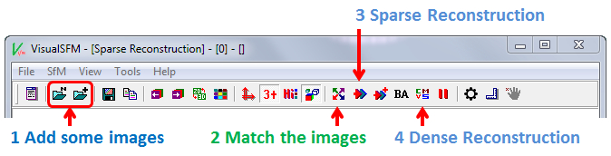

# VisualSFM-Manual
VisualSFM 실행 방법 메뉴얼 작성 / 실행 결과 저장

## Program Download Link    

LINK : http://ccwu.me/vsfm/
> 어지간하면 GPU를 사용하는 것이 좋음. 컴퓨팅 시간이 너무 많이 들어서 (Nvidia 계열)

## Sample Images Download Link (Not Official)

REFERENCE : https://peterfalkingham.com/2016/10/04/photogrammetry-testing-3-visualsfm-pmvs-meshlab/    
Download LINK : http://bitly.kr/L28vC4

## Needs
* 용량이 많은 3D 데이터를 처리하기 때문에 VRAM이 높고, 컴퓨팅 파워가 좋은 GPU를 가지고 있으면 좋음 (필자는 GTX 1060 6GB)    
* 엄청난 컴퓨팅 시간을 견딜 endurance    

## Use Sequence
    
    
    
    
    
    
    
    
> 거의 이거대로 따라하면 된다.    

### **1. File - Open+ Multi Images**

> 1~2 분 정도가 지나면 이미지들을 Load 한다.

### **2. Compute Missing Matches**

맨 윗 그림에서 버튼 \[2.\] 을 클릭한다.

### **3. Compute 3D Reconstruction**

버튼 \[3.\] Reconstruct Sparse를 클릭한다.    

해당 결과 이미지
>     

### **4. Dense Reconstruction**
    
버튼 \[4.\]를 클릭하여 CMVS 파일로 저장한다.

## How to Use VisualSFM

* 3D Point 모드에서 마우스 왼쪽 클릭 + 드래그를 하면 수평 방향으로 Point Cloud가 이동하며, 회전하는 기준점을 맞출 수 있음
* 3D Point 모드에서 마우스 오른쪽 클릭 + 드래그를 하면 기준점으로부터 Point Cloud가 회전함
* CTRL + 마우스 휠을 하면 촬영한 이미지가 투영되는 부분 확대
* CTRL + SHIFT + 마우스 휠을 하면 투영되는 Point를 확대

## Error Debugging

### CANNOT USE SiftGPU

#### Pairwise Matching 할 때, Log Window를 열면 0초만에 종료되고 SiftGPU를 사용할 수 없다고 뜬다.
> 해당 방법의 경우 메뉴얼을 찾아보면 나오겠지만 GPU 메모리를 할당 할 수 없거나 그래픽 카드를 사용할 수 없을때 발생하는 경우다.    
> 컴퓨터를 재부팅하여 VRAM을 확보하거나 드라이버를 확인해보자.
